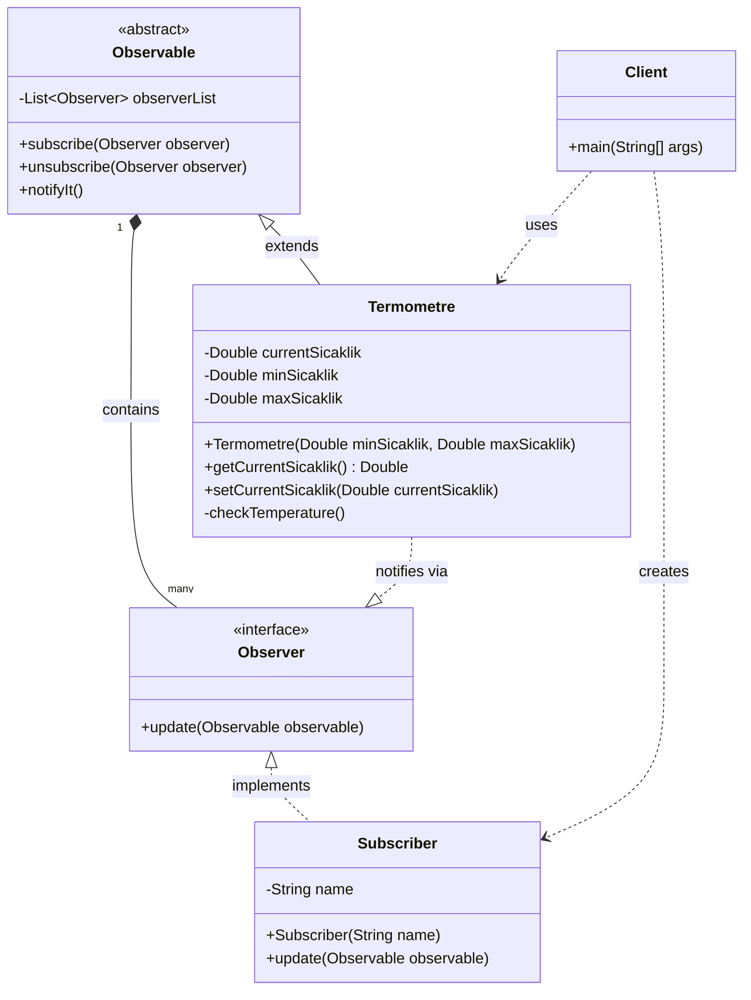
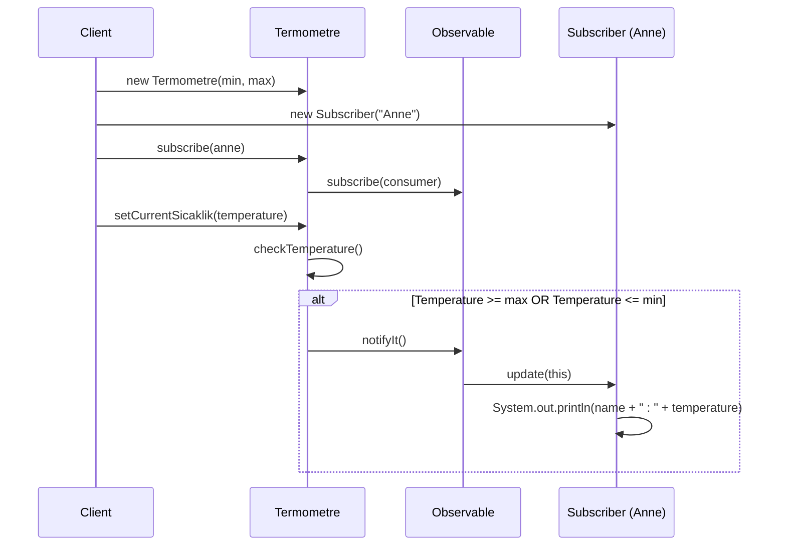

# Observer Pattern - Class Diagram

This diagram illustrates the Observer pattern implementation in the observable package.

## Sequence Diagram

The following sequence diagram shows the interaction flow when temperature changes:

