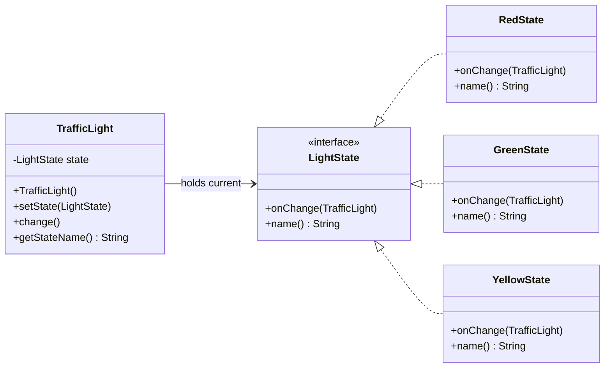

```mermaid
classDiagram
direction LR

    class TrafficLight {
        -LightState state
        +TrafficLight()
        +setState(LightState)
        +change()
        +getStateName() String
    }

    class LightState {
        <<interface>>
        +onChange(TrafficLight)
        +name() String
    }

    class RedState {
        +onChange(TrafficLight)
        +name() String
    }

    class GreenState {
        +onChange(TrafficLight)
        +name() String
    }

    class YellowState {
        +onChange(TrafficLight)
        +name() String
    }

    TrafficLight --> LightState : holds current
    LightState <|.. RedState
    LightState <|.. GreenState
    LightState <|.. YellowState
```